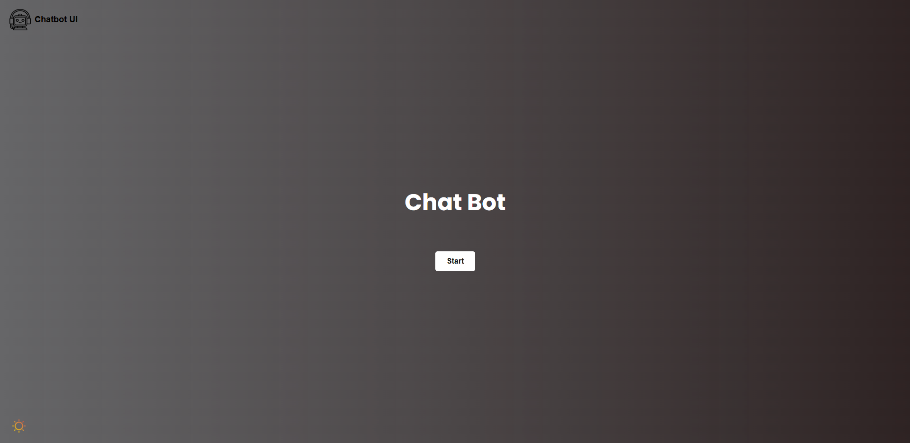
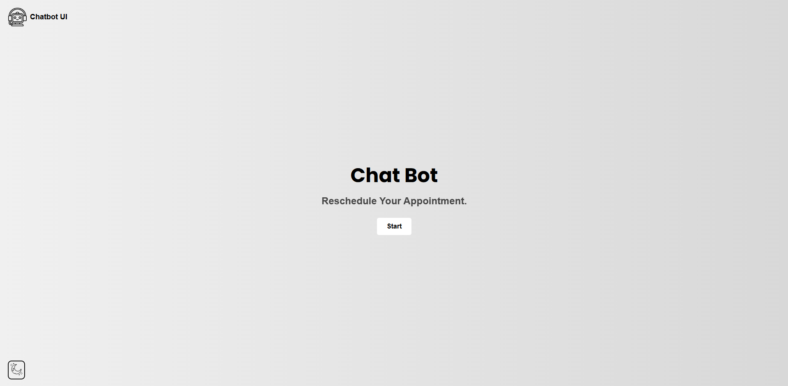
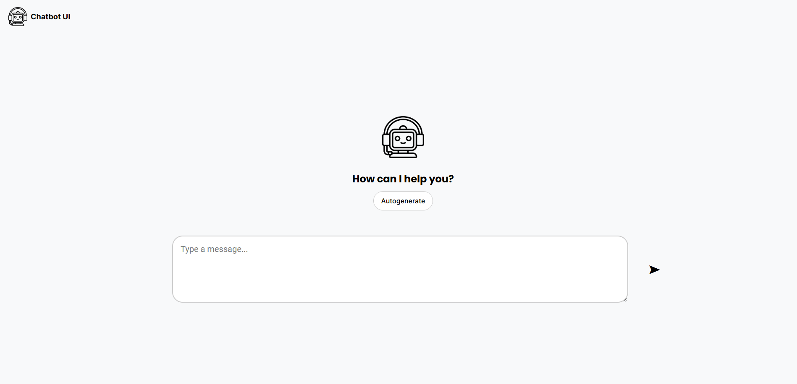
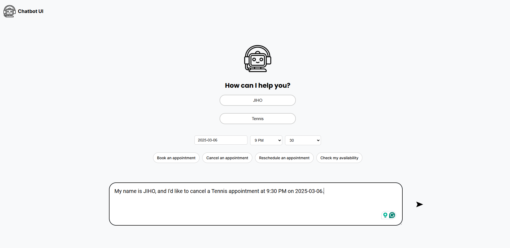
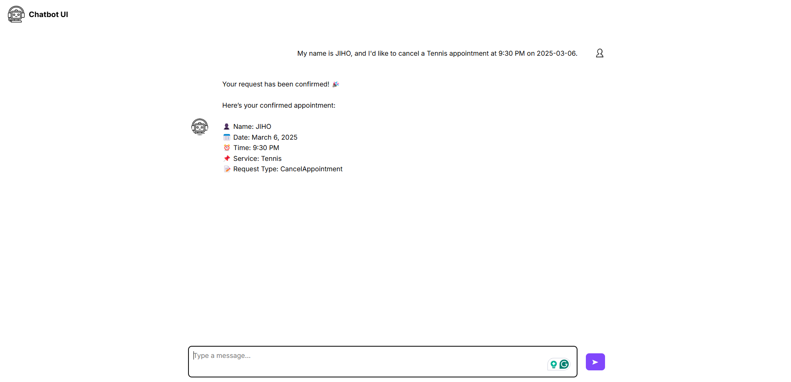

# 🚀 CSE156 Project

## 📌 Project Overview
This is a React-based project built with Vite. The project includes various components such as a chatbot, homepage, and styling using CSS. The main objective is to develop an interactive and user-friendly web application.

## 🛠 Technology Stack
- **Frontend:** React, JSX, CSS
- **Build Tool:** Vite
- **Package Manager:** npm

## 📂 Project Structure
```
📦 cse156_project
 ┣ 📂 node_modules
 ┣ 📂 public
 ┃ ┗ 📜 vite.svg
 ┣ 📂 src
 ┃ ┣ 📂 assets
 ┃ ┃ ┗ 📂 image
 ┃ ┃ ┃ ┣ 📜 homeicon.png
 ┃ ┃ ┃ ┣ 📜 moon.png
 ┃ ┃ ┃ ┗ 📜 sun.png
 ┃ ┣ 📂 screenshots
 ┃ ┃ ┣ 📜 UI1.png
 ┃ ┃ ┣ 📜 UI2.png
 ┃ ┃ ┣ 📜 UI3.png
 ┃ ┃ ┗ 📜 UI4.png
 ┃ ┣ 📜 App.jsx
 ┃ ┣ 📜 App.css
 ┃ ┣ 📜 Chatbot.jsx
 ┃ ┣ 📜 Chatbot.css
 ┃ ┣ 📜 ChatbotResponse.jsx
 ┃ ┣ 📜 ChatbotResponse.css
 ┃ ┣ 📜 Homepage.jsx
 ┃ ┣ 📜 Homepage.css
 ┃ ┣ 📜 main.jsx
 ┃ ┣ 📜 index.css
 ┣ 📜 .gitignore
 ┣ 📜 eslint.config.js
 ┣ 📜 index.html
 ┣ 📜 package.json
 ┣ 📜 package-lock.json
 ┣ 📜 vite.config.js
 ┗ 📜 README.md
```

## 📦 Installation & Setup
1. **Clone the Repository:**
   ```bash
   git clone https://github.com/hyukychang/cse156_project.git
   cd cse156_project
   ```

2. **Install Dependencies:**
   ```bash
   npm install
   ```

3. **Start the Development Server:**
   ```bash
   npm run dev
   ```

## 🎨 Features
- 🌙 Dark Mode & Light Mode toggle
- 💬 Interactive Chatbot component
- 🏠 Homepage with navigation
- 🎨 Responsive design using CSS

## 📸 Screenshots
### 1️⃣ Homepage (Homepage.jsx, Homepage.css)



### 2️⃣ Chatbot Interface (Chatbot.jsx, Chatbot.css)



### 3️⃣ Chatbot Response Component (ChatbotResponse.jsx, ChatbotResponse.css)


## 🤝 Contribution Guidelines
1. Fork the repository
2. Create a new branch (`git checkout -b feature-branch`)
3. Commit your changes (`git commit -m 'Add new feature'`)
4. Push to the branch (`git push origin feature-branch`)
5. Open a Pull Request

## 📜 License
This project is licensed under the MIT License.

## ✨ Author
- **Your Name** ([GitHub](https://github.com/your-username))

